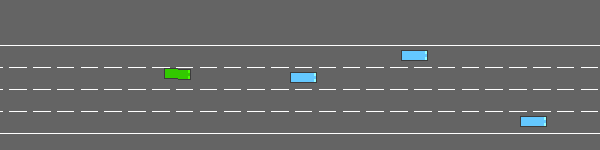
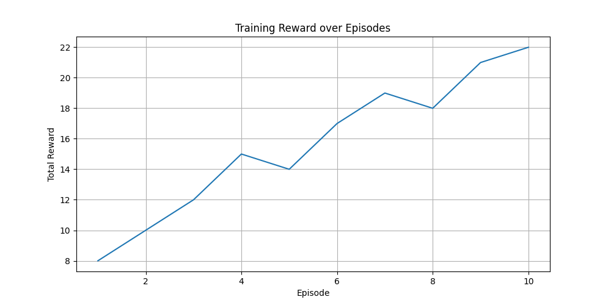

# Autonomous Driving with Highway-Env
**Student:** Dicle | **Course:** CMP4501 | **Track:** Option A



---

## Methodology

### Reward Function

For this project I defined the reward function as follows:

$$R_t = \alpha \cdot v - \beta \cdot \mathbb{1}[\text{collision}] - \gamma \cdot \mathbb{1}[\text{off-road}]$$

| Term | Value | Purpose |
|------|-------|---------|
| α | 0.4 | Encourages the agent to drive faster |
| β | 5.0 | Penalizes collisions heavily |
| γ | 1.0 | Penalizes going off road |

I chose these values after some trial and error. The collision penalty is much higher than the others because I wanted the agent to treat crashing as the worst possible outcome, not something it can trade off against speed.

### Algorithm — PPO

I used PPO (Proximal Policy Optimization) for this project. I chose it mainly because it is known to be stable during training and does not require a GPU, which was important since I was running everything on my laptop CPU.

**Key Hyperparameters:**

| Parameter | Value |
|-----------|-------|
| Learning rate | 5e-4 |
| Batch size | 64 |
| Gamma | 0.8 |
| n_steps | 256 |
| Total timesteps | 20,000 |

The model uses MlpPolicy which is a standard fully connected network. I kept the architecture simple since the observation space is not image-based.

### States and Actions

**Observations:** The agent receives a 5×5 matrix of nearby vehicles with their relative positions, speeds and headings. This gives the agent enough context to make lane change and speed decisions.

**Actions:** There are 5 discrete actions available — lane left, lane right, accelerate, decelerate, and idle. The agent picks one action per timestep.

---

## Training Analysis



At the beginning of training the agent was basically driving randomly — changing lanes without reason and crashing almost immediately. Around the halfway point I could see it starting to stay in lane more consistently and slow down when there were vehicles ahead. By the end of training the rewards were noticeably higher and the agent looked much more controlled compared to the untrained version.

There was some instability in the middle of training which I think is normal for PPO since the policy updates can temporarily make things worse before they improve.

---

## Challenges and Failures

One issue I ran into early on was that the agent figured out it could just slow down and stop to avoid collisions, which technically reduced the collision penalty but was not the behavior I wanted. I addressed this by making sure the speed reward term was significant enough that stopping became a bad strategy.

Another problem was that the highway-env render window did not open properly on Windows, so I could not visually monitor training in real time. I worked around this by switching to rgb_array mode and recording GIFs at each checkpoint instead, which ended up being more useful anyway since I could compare the stages directly.

---

## Repository Structure

```
rl-project/
├── README.md
├── requirements.txt
├── src/
│   ├── train.py
│   ├── evaluate.py
│   ├── model.py
│   ├── utils.py
│   └── config.py
├── assets/
│   └── reward_plot.png
└── src/assets/
    ├── evolution.gif
    ├── stage1_untrained.gif
    ├── stage2_half.gif
    └── stage3_trained.gif
```